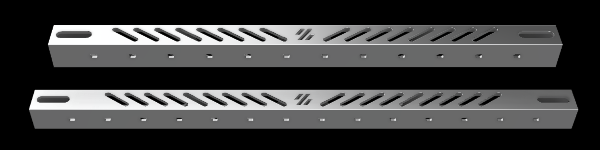

# VoronAluminumX

Aluminum X Extrusion for Voron Trident and v2.4 with MGN12H

<p align="center">
  
</p>

<p align="center">
  
</p>


<p align="center">
  
</p>


<p align="center">
  
</p>


Created by `aTinyShellScript` and `DoubleT`

Listing on [AliExpress](https://www.aliexpress.com/item/1005004121247823.html)

This mod requires the use of umbilical instead of drag chains.


## Static Structual Analysis of Aacceleration Deflection

Analysis created by `TorxFigther` using:

```
- Aluminum Tube for 300mm build size
- Toolhead weight of 450g
- 10k acceleration.
```

Deflection/deformation amount: 0.00456mm

<p align="center">
  
</p>

<p align="center">
  
</p>

## Thermal Expansion Analysis

TBD


## BOM

- Aluminum Tube (20x20x16mm) - [Ali Express](https://www.aliexpress.com/item/1005004121247823.html) 
    - 330mm for a 250mm bed size
    - 380mm for a 300mm bed size
- MGN12H
    - 300mm for a 250mm bed size
    - 350mm for a 300mm bed size
- 6x M5 tnuts
    - [Amazon](https://www.amazon.com/gp/product/B07FPLZXTF)
- 7-10x M3 Flanged Locknuts or hexnuts (Rail mounting)
- 4x M5x12 Button Head Cap Screws (Top XY Joint)
    - Titanium - [Ali Express](https://www.aliexpress.com/item/4000389824742.html)
- 2x M5x30 Button Head Cap Screws (Bottom XY Joint)
- 8x M5 hexnuts
    - Titanium - [Ali Express](https://www.aliexpress.com/item/4000184619832.html)
- 8x M5x40mm SHCS
    - Titanium - [Ali Express](https://www.aliexpress.com/item/2255800962752030.html)


